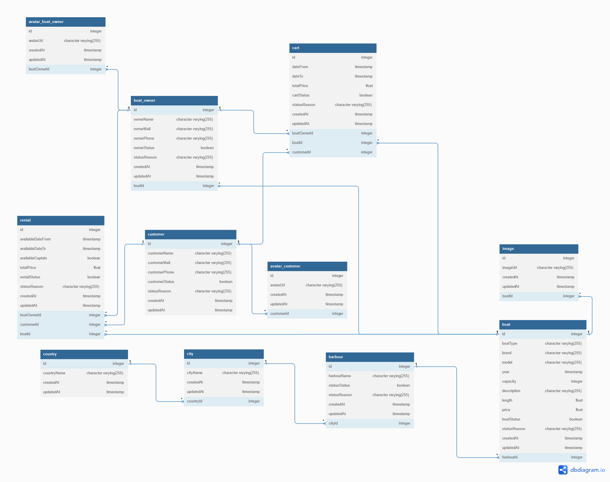

# RENT A BOAT
### Estado: En construcción
[ENGLISH VERSION](https://github.com/migmm/rentaboat/blob/main/README.md)

First commit 16/10/2022

## Portal de alquiler de botes

TODO

Para el frontend se utilizará:

- HTML
- CSS
- JS
- SASS
- Arquitectura BEM

Para el Backend se utilizó:

- Node.JS
- Express
- Sequelize
- Base de datos PostgreSQL
- Diseño por capas para una mejor comprensión y escalabilidad

Database schema

