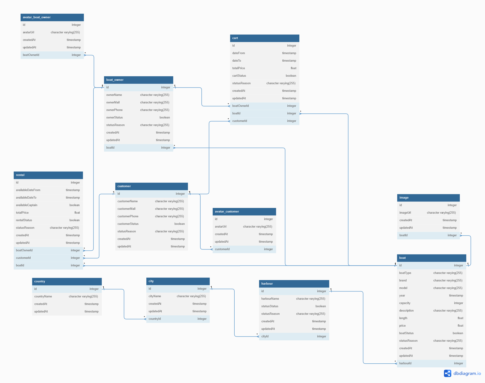

# RENT A BOAT
### Status: In progress 

[PARA LEER EN ESPAÑOL](https://github.com/migmm/rentaboat/blob/main/README-ES.md)

## Portal for boat rental

In frontend I will use:

#### TODO

- HTML
- CSS
- JS
- SASS
- BEM arquitecture

In Backend I used:

- Node.JS
- Express
- PostgreSQL database hosted in [ElephahtSQL](https://www.elephantsql.com/)
- Layer design for a better scalability and faster understanding

### Database schema

